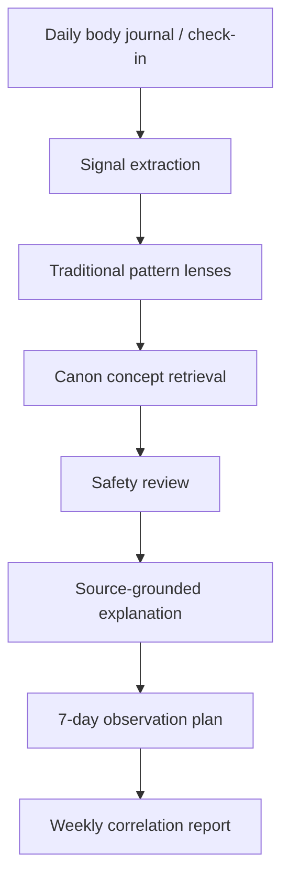

# NEIJING ATLAS — Traditional Body Pattern Intelligence Framework

NEIJING ATLAS is an AI-assisted body-signal tracking and reflection framework inspired by the *Huangdi Neijing* and classical Chinese medical systems thinking.

<p align="center">
  <a href="https://demo.tutu.mobi/neijing-atlas/">
    
  </a>
</p>

It helps users organize everyday observations — sleep rhythm, energy, digestion, temperature, moisture, emotion, pain/tension, season, and work rhythm — into source-grounded traditional pattern lenses without making medical diagnoses.

- **Public interactive demo:** <https://demo.tutu.mobi/neijing-atlas/>
- **GitHub repository:** <https://github.com/ngocquynh85/neijing-atlas-body-pattern-engine>

> **Status:** pilot scaffold. This repository validates the product concept, data model, safety boundary, prompt design, token rationale, and a runnable mock pipeline before real full-corpus/model integration.

## Interactive prototype

The public prototype demonstrates daily signal capture, traditional pattern lens mapping, source evidence, safety boundaries, and a 7-day observation plan.

<p align="center">
  <a href="https://demo.tutu.mobi/neijing-atlas/">
    
  </a>
</p>

> Prototype note: this is not medical diagnosis or treatment advice. It is a visual proof-of-work for a safe, source-grounded pattern-reflection engine.

## Why this project exists

Most modern health trackers collect isolated metrics: sleep hours, steps, calories, heart rate, glucose, or HRV. Those signals are useful, but many people still struggle to understand everyday body patterns: why stress affects digestion, why late sleep clusters with fatigue, why humid weather changes heaviness, or why emotional tension and body stiffness appear together.

Traditional Chinese medicine and the *Huangdi Neijing* offer a pattern-first lens: observing relationships between rhythm, food, emotion, climate, temperature, fluids, movement, and body sensation. NEIJING ATLAS turns that lens into an auditable AI workflow.

## Important safety boundary

This project does **not** provide medical diagnosis, treatment, herbal prescriptions, acupuncture instructions, or emergency triage. It is for cultural, educational, and self-observation support.

Every interpretation should be framed as:

- a **pattern lens**, not a disease label
- a **reflection aid**, not a diagnosis
- a **source-grounded explanation**, not medical certainty
- an **observation plan**, not treatment advice

Red-flag symptoms should route users to professional medical care.

## Core workflow



## Pattern lenses

The pilot focuses on eight observation axes:

1. **Rhythm** — sleep/wake timing, meal timing, overwork, recovery.
2. **Energy** — morning/trough energy, post-meal fatigue, caffeine dependency.
3. **Digestion** — appetite, bloating, heaviness, stool tendency, late eating.
4. **Temperature** — cold/hot preference, cold hands/feet, thirst, sweating.
5. **Moisture** — dryness, heaviness, phlegm/fluid signs, humid-weather sensitivity.
6. **Emotion** — irritability, worry, dullness, anxiety, stress-body coupling.
7. **Pain/tension** — stiffness, fixed/moving discomfort, cold/stress/movement relation.
8. **Environment** — season, humidity, heat/cold, air conditioning, travel, workload.

## Example output style

Input:

```text
Slept at 1:30am, woke tired. Hands cold in the morning. Felt bloated after lunch. Irritable in the afternoon. Weather was rainy and humid.
```

Output:

```text
Observed signal clusters:
- Rhythm strain: late sleep + morning fatigue
- Cold/damp lens relevance: cold hands + humid weather + bloating
- Digestion-energy link: post-meal heaviness + afternoon fatigue
- Emotion-qi movement lens: irritability paired with digestive tension

This is not a diagnosis. Suggested 7-day observation: track bedtime, dinner time, warm/cold food preference, stool tendency, afternoon energy, weather, and stress level.
```

## Quick start

```bash
python3 -m venv .venv
source .venv/bin/activate
pip install -e .
neijing-atlas demo
neijing-atlas estimate
```

No API key is required for the mock pipeline.

## Repository contents

- `docs/application_english.md` — short token-application dossier.
- `docs/architecture.md` — system architecture and data model.
- `docs/safety_policy.md` — diagnosis/prescription boundary and red-flag policy.
- `docs/token_justification.md` — why the workload can consume large token allocations.
- `docs/data_policy.md` — source and licensing strategy.
- `docs/demo_prototype.md` — public prototype screenshots and description.
- `docs/assets/` — README/demo screenshots.
- `data/source_manifest.jsonl` — candidate source references and licensing notes.
- `fixtures/sample_daily_journal.json` — mock user observation input.
- `fixtures/sample_canon_passages.jsonl` — small sample classical concept fixtures.
- `prompts/` — prompt templates for extraction, mapping, explanation, and safety review.
- `src/neijing_atlas/` — runnable mock pipeline.
- `sql/schema.sql` — relational schema for passages, concepts, body signals, runs, and reviews.

## Design principles

- Track relationships, not isolated metrics.
- Preserve uncertainty; do not silently convert pattern lenses into diagnoses.
- Store source passages, translations, concept mappings, model outputs, safety flags, and review notes separately.
- Use classical evidence as context, not as unquestioned medical authority.
- Prefer safe observation experiments over advice, prescription, or treatment.
