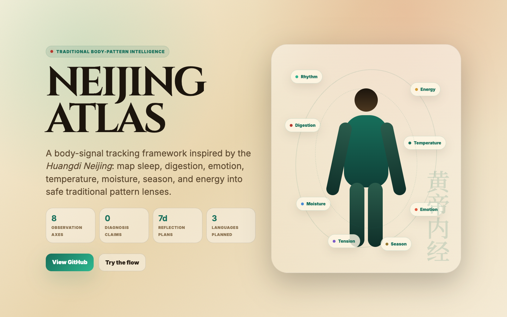
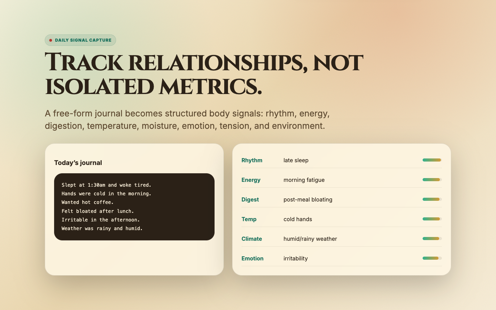
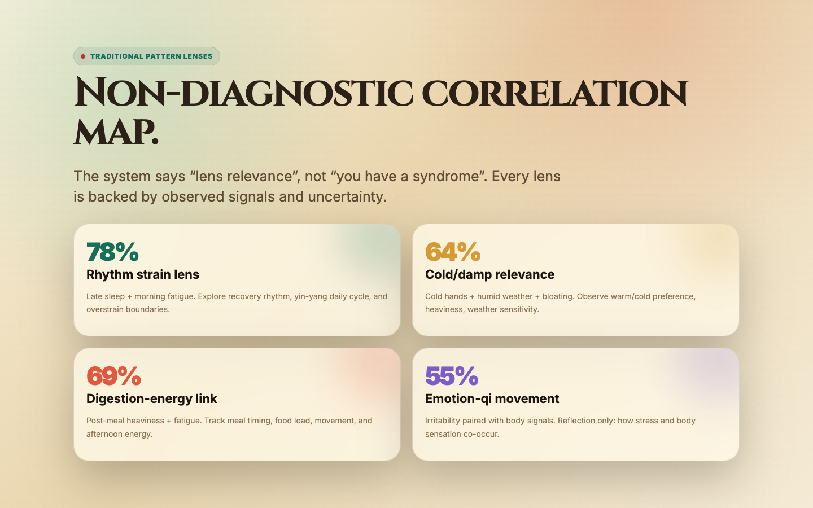
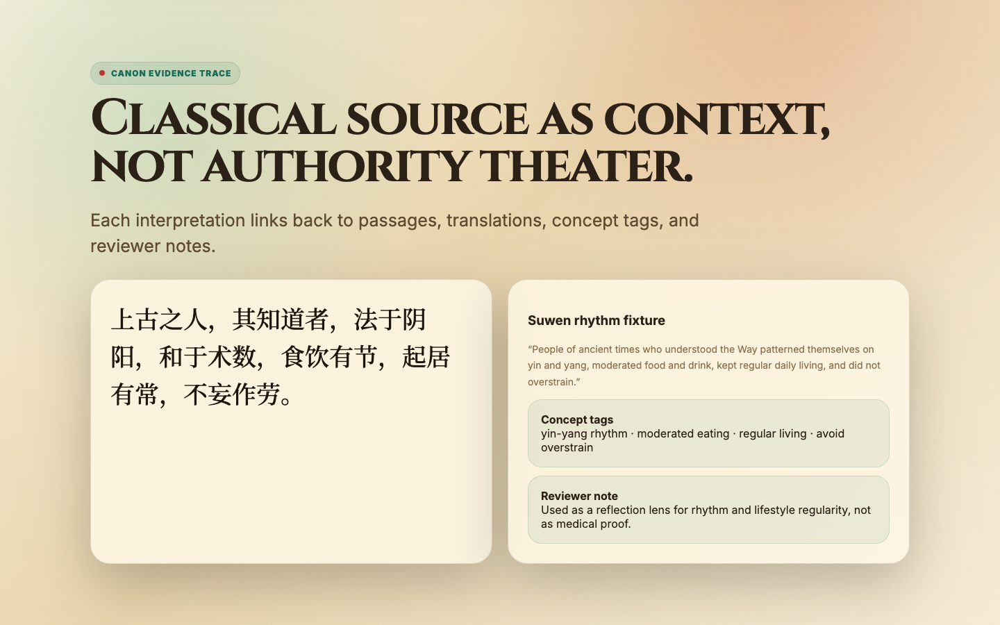
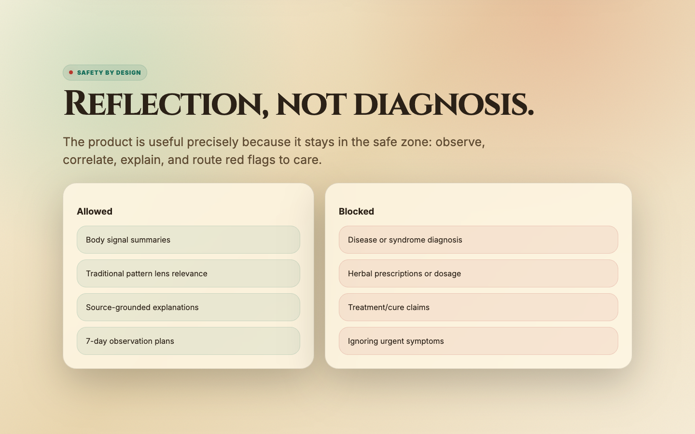
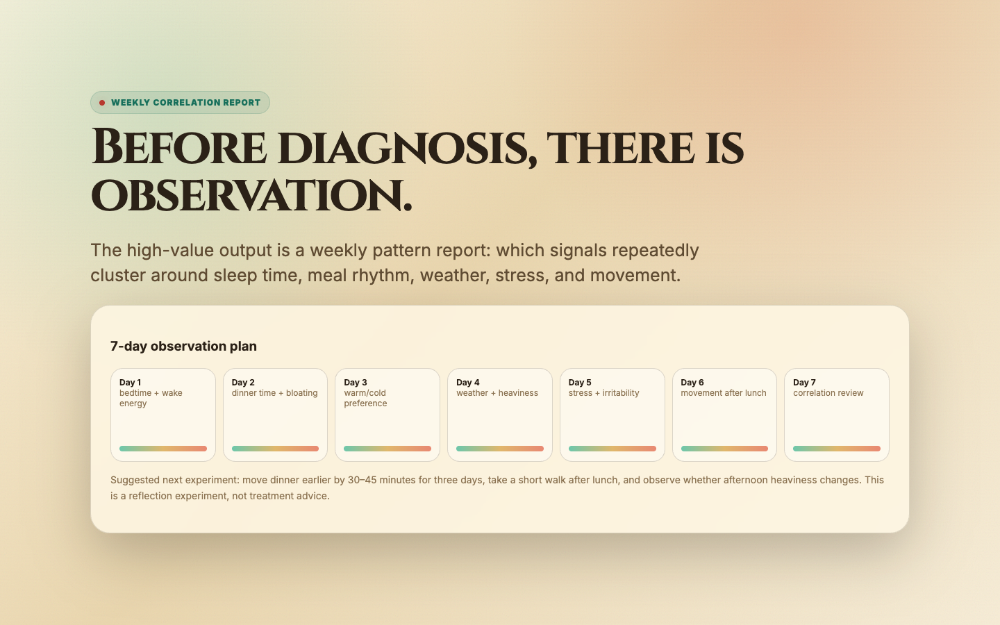

# NEIJING ATLAS Interactive Prototype

Public demo: <https://demo.tutu.mobi/neijing-atlas/>

The prototype demonstrates a traditional body-pattern tracking workflow:

1. daily signal capture
2. eight-axis body pattern map
3. classical concept evidence
4. safety boundary
5. 7-day observation plan
6. weekly correlation report

> Prototype note: this is not medical diagnosis or treatment advice. It is a visual proof-of-work for a safe, source-grounded pattern-reflection engine.

## Screenshots

### Hero

### Daily signal capture

### Traditional pattern lenses

### Canon evidence trace

### Safety boundary

### Weekly correlation report

